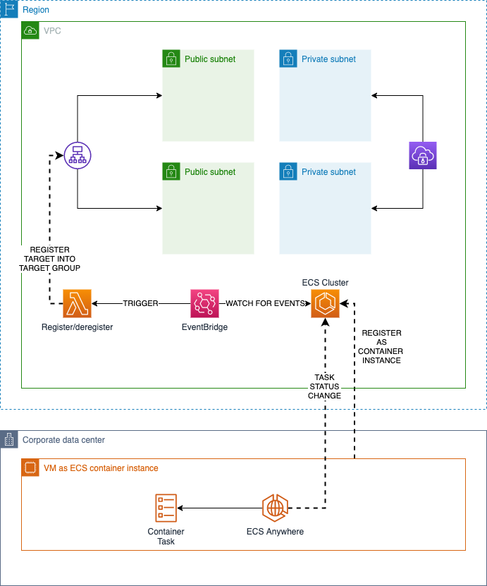

# ECS Anywhere concept to register targets in target group

This project is a proof-of-concept to showcase how to leverage ECS ANywhere in a hybrid scenario.
Out of the box, ECS Anywhere does not support load balancing therefore your tasks don't register automatically in a target group.

However, nothing prevents us to build a solution to automate this scenario, in case we want to use the AWS Elastic Load Balancer service.
By the way, ECS Anywhere services can also load balanced with other solutions, namely on-premises ones but this exercise is meant to show one particular use-case.

## The solution

The proposed solution design is based on a Lambda function that performs that registration/deregistration of targets into a target group.
The function is triggered by specific EventBridge rules, filter for ECS task status changes.

Specifically, we are looking at tasks that reach the RUNNING and STOPPED statuses.

On top of that, the solutions integrates a client VPN configuration to bridge a NATted VM (i.e. a VM running at home) to the VPC and make sure that newly registered target is reachable by the target group, to be considered healthy.

## How to use

The project provides a script `full.sh` to fully deploy the solution and it's based on the use of Parallels Desktop for Mac as the virtualization product.

Please do not consider the script as a final version, since it's based on my workstation paths.

The script assumes that you already configured a Linux VM called `ECS` and a snapshot that you want to use as your stable starting point.

In particular, the script performs the following steps:

- deploys the SAM stack through CloudFormation
- reverts the VM to the snapshot and boot it
- prepares the VM registration by creating an SSM hybrid activation record
- executes a script in the VM to register it to SSM and the ECS cluster as a container instance
- connects the instance to the client VPN endpoint to ensure connectivity

## Prerequisite

The solution is based on mutual authentication for the client VPN service so appropriate certificates need to be created.
The script `pki/ca.sh` is responsible of:

- fetching the easyRSA package from GitHub
- performing all the necessary steps to create the assets (some steps are interactive)
- upload the certificates to AWS Certificate Manager
- create a parameters script with the certificates ARNs (`params.sh`), which is then sources by `full.sh`

This script should only be executed the first time you create the certificates.

The solution is also configured to establish an OpenVPN connection to the VPC for container traffic and health check.
In order to configure this subsystem, the script `vpn/build.sh` must be executed and it is responsible for dynamically (re)create the appropriate VPN client configuration.
